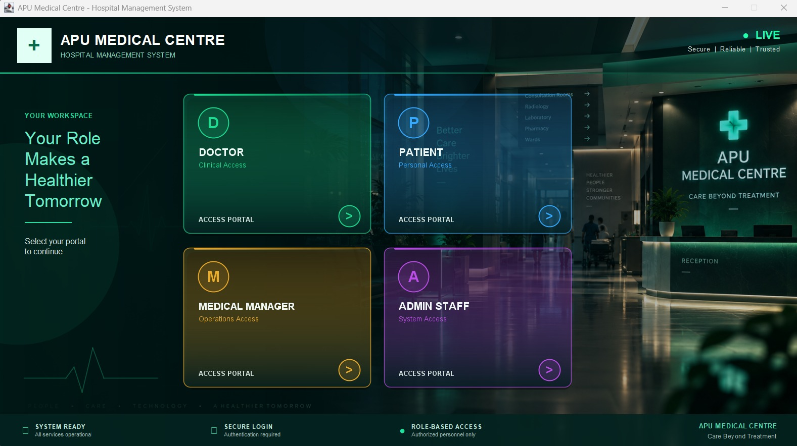
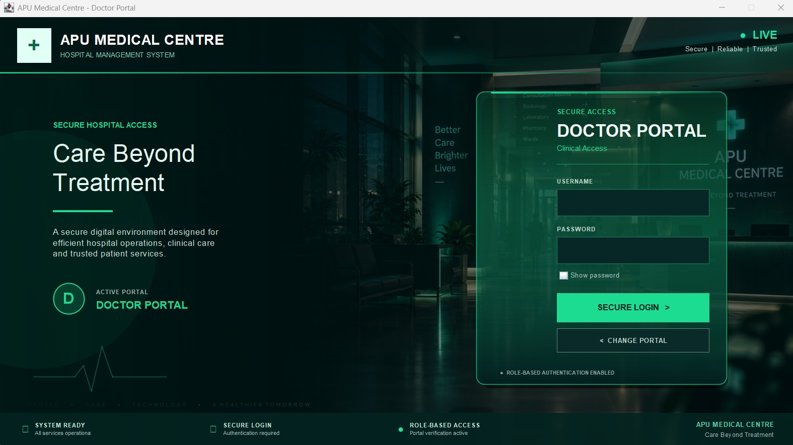
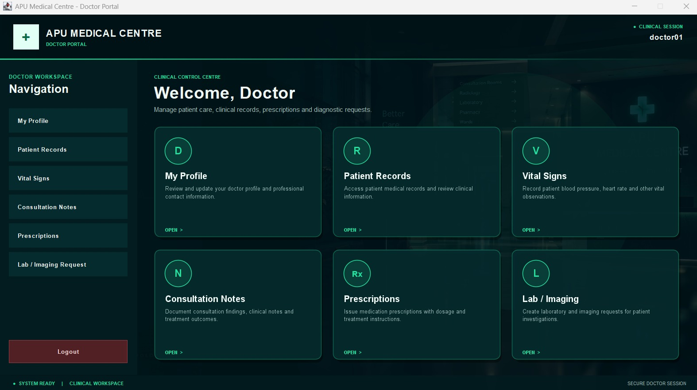
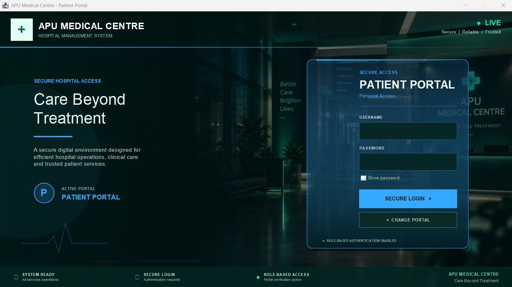
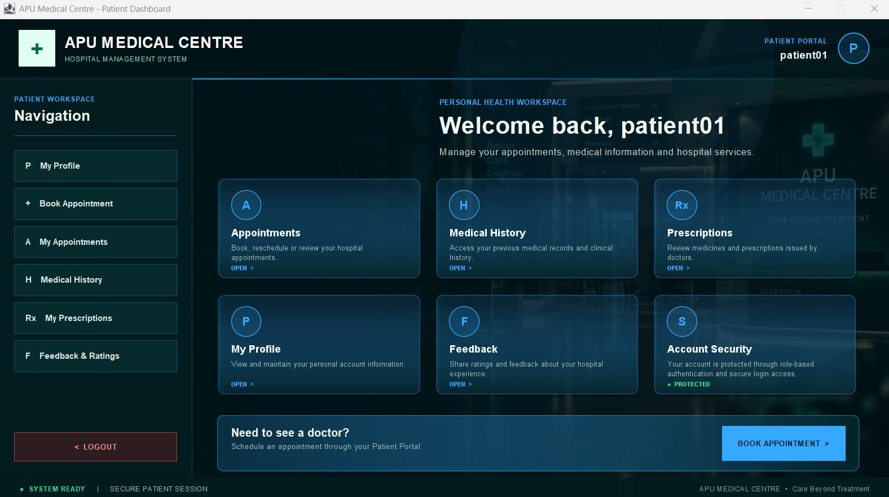
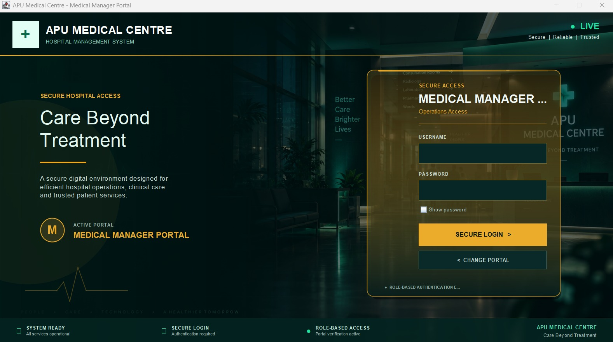
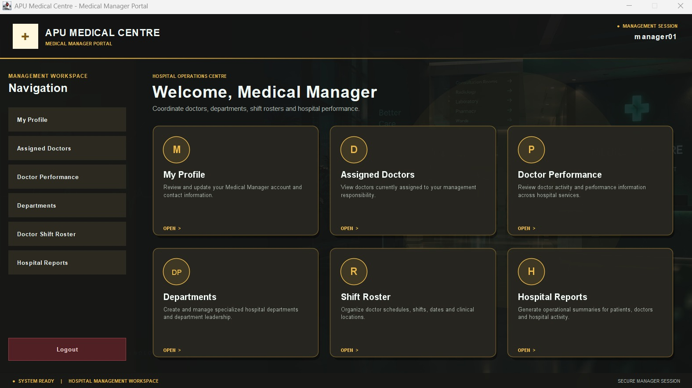
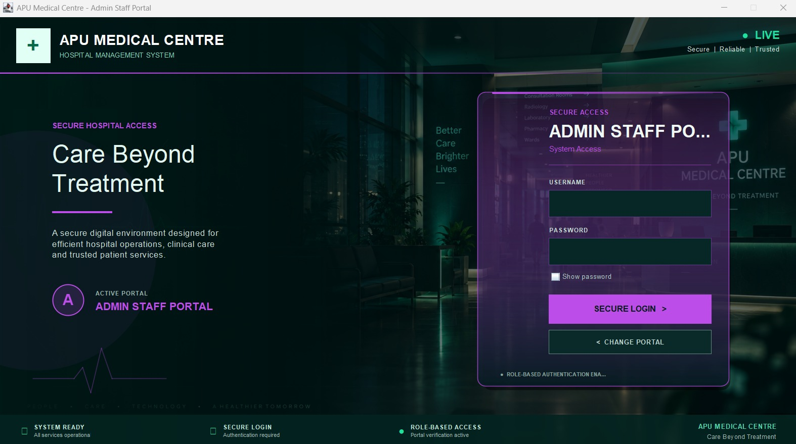
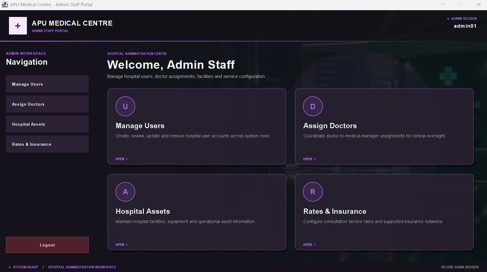

# 🏥 Hospital Management System

A modern, role-based **Hospital Management System** developed entirely in **Java**, designed to support hospital administration, clinical workflows, patient services, and medical management through a professional desktop interface.

The application is built using **Java Swing** and applies **Object-Oriented Programming (OOP)** principles, event-driven GUI development, validation, CRUD operations, and file-based data persistence.

---

## 📌 Project Overview

The Hospital Management System provides a centralized desktop environment for managing different areas of hospital operations.

The application implements **role-based access**, where each user enters through a dedicated portal and receives functionality appropriate to their responsibilities.

The system contains four primary roles:

- 👨‍⚕️ **Doctor**
- 👤 **Patient**
- 🏥 **Medical Manager**
- ⚙️ **Admin Staff**

Each role includes its own secure login interface, dashboard, functionality, navigation system, and distinctive visual identity.

---

## ✨ Core Features

### 👨‍⚕️ Doctor Portal

The Doctor Portal supports clinical activities and patient care.

Doctors can:

- Manage their profile
- Access patient medical records
- Record and review patient vital signs
- Add consultation notes
- Create prescriptions
- Review prescription information
- Submit laboratory and imaging requests
- Access clinical information through a dedicated dashboard

---

### 👤 Patient Portal

The Patient Portal allows patients to interact with hospital services and access their medical information.

Patients can:

- Manage their profile
- Book appointments with available doctors
- Select doctors based on specialty
- Reschedule appointments
- Cancel appointments
- View their appointments
- View medical history
- View prescriptions
- Submit hospital feedback and ratings

The appointment system also performs validation to help prevent invalid dates and conflicting doctor appointments.

---

### 🏥 Medical Manager Portal

The Medical Manager Portal provides tools for coordinating doctors and hospital operations.

Medical Managers can:

- Manage their profile
- View assigned doctors
- Review doctor performance
- Create and manage specialized departments
- Manage doctor shift rosters
- Coordinate clinical resources
- Generate hospital reports

---

### ⚙️ Admin Staff Portal

The Admin Staff Portal provides centralized administrative control over the hospital system.

Admin Staff can:

- Create hospital user accounts
- View registered users
- Update user information
- Remove users
- Assign doctors to Medical Managers
- Manage hospital assets and facilities
- Maintain asset status and location information
- Configure consultation and service rates
- Manage supported insurance networks

---

## 🔐 Role-Based Access

The application follows a role-based navigation flow:

```text
Application Launch
        │
        ▼
Role Selection Portal
        │
        ├── Doctor
        │      │
        │      ▼
        │   Doctor Login
        │      │
        │      ▼
        │   Doctor Dashboard
        │
        ├── Patient
        │      │
        │      ▼
        │   Patient Login
        │      │
        │      ▼
        │   Patient Dashboard
        │
        ├── Medical Manager
        │      │
        │      ▼
        │   Medical Manager Login
        │      │
        │      ▼
        │   Medical Manager Dashboard
        │
        └── Admin Staff
               │
               ▼
           Admin Login
               │
               ▼
           Admin Dashboard
```

Users authenticate through the portal corresponding to their assigned role before accessing the relevant dashboard and features.

---

## 🎨 User Interface Design

The system uses a custom dark hospital-themed interface designed specifically for the application.

Each portal has its own accent color to provide a clear visual identity:

| Role | Interface Theme |
| --- | --- |
| 👨‍⚕️ Doctor | Emerald Green |
| 👤 Patient | Blue |
| 🏥 Medical Manager | Gold |
| ⚙️ Admin Staff | Purple |

The interface includes:

- Role-specific dashboards
- Secure login screens
- Navigation sidebars
- Interactive dashboard cards
- Styled forms
- Dark data tables
- Custom buttons
- Status indicators
- Hospital branding
- Background graphics
- Consistent role-specific visual styling

---

## 🛠️ Technologies Used

| Technology | Purpose |
| --- | --- |
| **Java** | Core application development |
| **Java Swing** | Desktop graphical user interface |
| **Java AWT** | UI components, graphics and event handling |
| **OOP** | Application architecture and role modelling |
| **Java File I/O** | Persistent text-file data storage |
| **Git** | Version control |
| **GitHub** | Source-code hosting and portfolio presentation |
| **Visual Studio Code** | Development environment |

---

## 🧠 Programming Concepts Demonstrated

The project demonstrates practical implementation of:

- Object-Oriented Programming
- Classes and objects
- Inheritance and role modelling
- Encapsulation
- Modular application design
- Role-based access
- Java Swing GUI development
- Event-driven programming
- File handling
- CRUD operations
- Input validation
- Appointment scheduling
- Medical record management
- User management
- Resource management
- Data-table manipulation
- Error handling
- Desktop application workflow design

---

## 💾 Data Persistence

The application uses **text-file persistence** rather than an external database.

Application information is stored inside the `data/` directory.

This includes data related to:

- User accounts
- Appointments
- Medical records
- Prescriptions
- Doctor-manager assignments
- Doctor shift rosters
- Departments
- Hospital assets
- Consultation rates
- Insurance networks
- Laboratory and imaging requests
- Patient feedback

This approach demonstrates persistent data management using Java File I/O without relying on a database management system.

---

## 📁 Project Structure

```text
Hospital Management System/
│
├── assets/
│   └── hospital_portal_bg.png
│
├── data/
│   ├── appointments.txt
│   ├── consultation_rates.txt
│   ├── departments.txt
│   ├── doctor_manager_assignments.txt
│   ├── doctor_roster.txt
│   ├── feedback.txt
│   ├── hospital_assets.txt
│   ├── insurance_networks.txt
│   ├── lab_requests.txt
│   ├── medical_records.txt
│   ├── prescriptions.txt
│   └── users.txt
│
├── screenshots/
│   ├── role-selection.jpeg
│   ├── doctor-login.jpeg
│   ├── doctor-dashboard.jpeg
│   ├── patient-login.jpeg
│   ├── patient-dashboard.jpeg
│   ├── medical-manager-login.jpeg
│   ├── medical-manager-dashboard.jpeg
│   ├── admin-login.jpeg
│   └── admin-dashboard.jpeg
│
├── src/
│   └── Java source files
│
├── .gitignore
└── README.md
```

---

# 📸 Application Showcase

## 🏥 Role Selection Portal

The application begins with a centralized portal where users select their hospital role before authentication.



---

## 👨‍⚕️ Doctor Portal

### Doctor Login

A dedicated role-based authentication interface provides doctors with access to the clinical workspace.



### Doctor Dashboard

The Doctor Dashboard provides centralized access to patient records, vital signs, consultation notes, prescriptions, and laboratory/imaging requests.



---

## 👤 Patient Portal

### Patient Login

Patients authenticate through their dedicated portal before accessing personal healthcare services.



### Patient Dashboard

The Patient Dashboard provides access to appointments, medical history, prescriptions, profile management, and feedback functionality.



---

## 🏥 Medical Manager Portal

### Medical Manager Login

A dedicated authentication interface provides Medical Managers with access to hospital coordination and management functionality.



### Medical Manager Dashboard

The Medical Manager Dashboard provides access to assigned doctors, performance information, departments, doctor shift rosters, and hospital reports.



---

## ⚙️ Admin Staff Portal

### Admin Staff Login

Administrative users authenticate through a dedicated hospital administration portal.



### Admin Staff Dashboard

The Admin Staff Dashboard provides centralized management of hospital users, doctor assignments, hospital assets, consultation rates, and insurance networks.



---

## 🚀 Getting Started

### Prerequisites

Before running the application, ensure that you have:

- **JDK 17 or later**
- **Visual Studio Code** with Java support, or another Java IDE
- Git if you want to clone the repository using the command line

---

### Clone the Repository

```bash
git clone https://github.com/merciful-islam-01/Hospital-Management-System.git
```

Then open the cloned project directory:

```bash
cd Hospital-Management-System
```

---

### Running with Visual Studio Code

1. Open the project folder in **Visual Studio Code**.
2. Install the **Extension Pack for Java** if Java support is not already installed.
3. Make sure the `assets/` and `data/` folders remain in the project root.
4. Open:

```text
src/Main.java
```

5. Click **Run** above the `main()` method.

The application will launch the **Role Selection Portal**.

---

## 🏗️ Application Architecture

The application separates responsibilities across multiple Java classes and GUI frames.

The general architecture follows:

```text
User
 │
 ├── Doctor
 ├── Patient
 ├── Medical Manager
 └── Admin Staff

Role Selection
       │
       ▼
Authentication
       │
       ▼
Role Dashboard
       │
       ▼
Role-Specific Features
       │
       ▼
File-Based Persistence
```

This separation helps keep the system modular and allows each hospital role to maintain its own functionality while sharing a common application environment.

---

## 🔎 Key System Highlights

- Four independent role-based portals
- Dedicated authentication flow
- Modern Java Swing desktop interface
- Role-specific dashboards
- Persistent application data
- Appointment booking and management
- Doctor scheduling
- Medical records
- Prescriptions
- Laboratory and imaging requests
- Hospital asset management
- User administration
- Department management
- Consultation rate configuration
- Insurance network management
- Patient feedback and ratings
- Hospital reporting
- Consistent hospital-themed UI

---

## 🎯 Project Purpose

This project was developed to demonstrate the design and implementation of a complete multi-role desktop information system using Java.

It combines software-development concepts with a practical hospital-management scenario and demonstrates the ability to design:

- Application workflows
- Role-specific functionality
- Graphical interfaces
- Persistent data handling
- Validation logic
- CRUD operations
- Modular Java components

---

## 👨‍💻 Developer

### Merciful Islam

Cyber Security student interested in **secure software development, application security, and DevSecOps Engineering**.

This project reflects my practical experience with Java application development, GUI design, role-based system architecture, persistent data handling, debugging, testing, and iterative software development.

---

## 📌 Project Status

**✅ Completed and Functional**

The application currently supports complete operational workflows for:

- Doctor
- Patient
- Medical Manager
- Admin Staff

---

## 🔮 Future Improvements

Potential future development could include:

- Migration from text-file persistence to a relational database
- Password hashing and stronger authentication
- Fine-grained authorization controls
- Audit logging
- Automated testing
- Maven or Gradle build management
- REST API integration
- Improved reporting and analytics
- Deployment automation
- CI/CD pipeline integration

These improvements would provide opportunities to further evolve the project toward a more production-oriented and DevSecOps-focused architecture.

---

## ⭐ Repository

If you find this project useful or interesting, feel free to explore the source code and application design.

---

**Developed with Java ☕ by Merciful Islam**